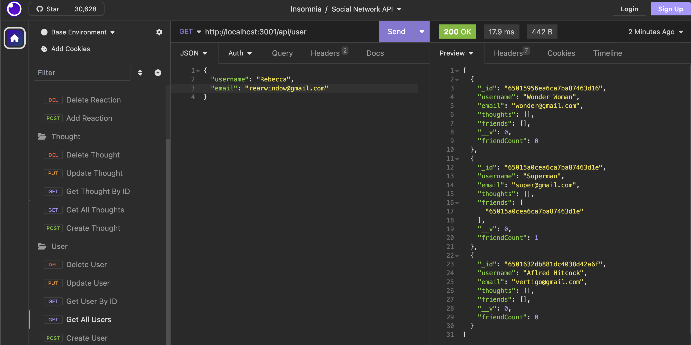

# BC18-Social-Network-API

## 🌏 Table of Contents:
- [Description](#description)
- [Installation](#installation)
- [Usage](#usage)
- [Video Walkthrough](#video-walkthrough)
- [Application UI](#application-user-interface)
- [Credits & Resources](#credits-and-resources)
- [Coded With](#coded-with)
- [Contributing](#contributing)
- [License](#license)

## Description:
* With its large and unstructured data, MongoDB makes it a top pick for social networks. To meet the challenge of building a social network web app API. We'll employ Express.js for routing, leverage a MongoDB database and utilize Mongoose ODM. Additionally, we'll integrate a JavaScript date library to utilize the native Date object for timestamp formatting.

* BONUS COMPLETED: Application deletes a user's associated thoughts when the user is deleted. Feature to remove a user's associated thoughts when deleted.

### User Story:
```md
AS A social media startup
I WANT an API for my social network that uses a NoSQL database
SO THAT my website can handle large amounts of unstructured data
```
### Acceptance Criteria:
```md
GIVEN a social network API
WHEN I enter the command to invoke the application
THEN my server is started and the Mongoose models are synced to the MongoDB database
WHEN I open API GET routes in Insomnia for users and thoughts
THEN the data for each of these routes is displayed in a formatted JSON
WHEN I test API POST, PUT, and DELETE routes in Insomnia
THEN I am able to successfully create, update, and delete users and thoughts in my database
WHEN I test API POST and DELETE routes in Insomnia
THEN I am able to successfully create and delete reactions to thoughts and add and remove friends to a user’s friend list
```

## Installation:
* `git clone the repository`
* `npm install`
* `npm start`


## Usage:
* To test routes, please install [Insomnia](https://insomnia.rest/) if you have not already.


## Video Walkthrough:
* 🎥 [Video Walkthrough: Social Network API.](https://www.youtube.com/watch?v=8C7mdaU2JL0)

## Application User Interface:


## Credits and Resources:
* Google search & Youtube videos.
* Mini Project 18: EdX and UCB.
* ChatGpt for troubleshooting.
* Stack Overflow & MDN.

## Coded With:
* Express.js.
* Insomnia.
* MongoDB.
* Node.js.
* VS Code.
* Youtube.

## Contributing:
* Any ideas or feedback is very much appreciated.


## License:
[](https://opensource.org/licenses/MIT)